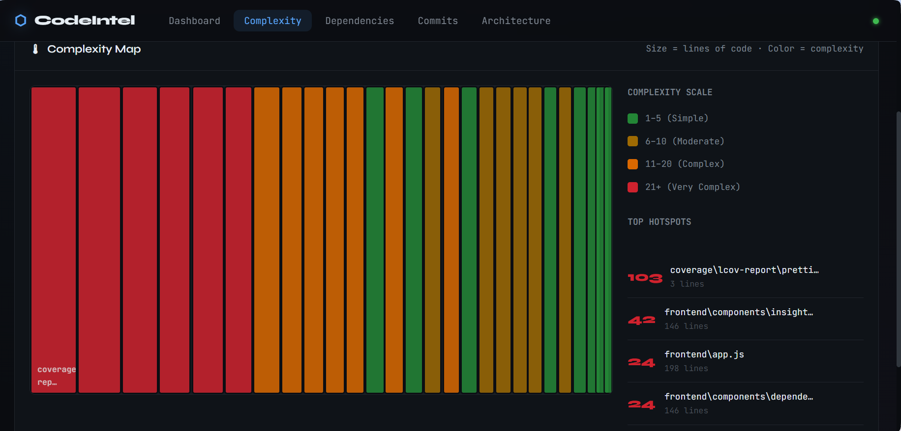
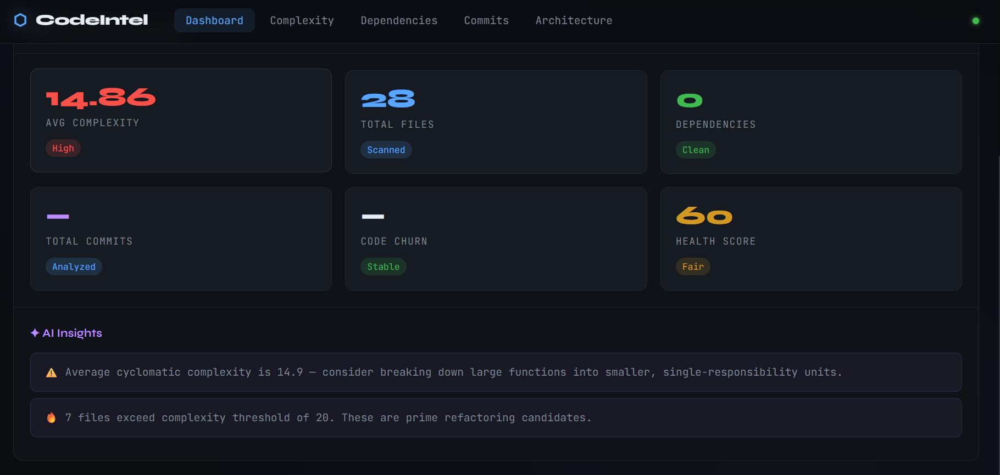
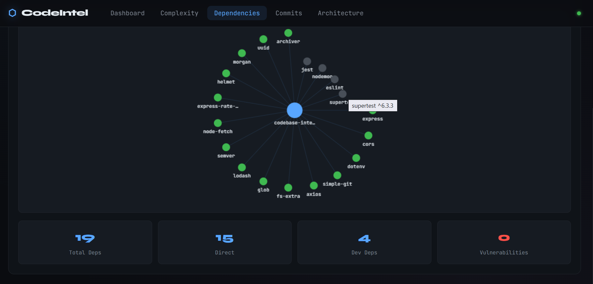

#  Codebase Intelligence Platform

A comprehensive platform for deep codebase analysis — featuring complexity metrics, dependency scanning, commit timeline visualization, and AI-powered architectural insights.

  
## Features

- **Complexity Analysis** — Cyclomatic complexity, hotspot detection, and code health scoring
- **Dependency Scanning** — NPM package analysis, vulnerability detection, and dependency graphs
- **Commit Timeline** — Visual history of changes, contributor activity, and churn analysis
- **Architecture Visualization** — Auto-generated dependency graphs and module relationship maps
- **AI Insights** — LLM-powered code quality recommendations and refactoring suggestions

## Project Structure

codebase-intelligence-platform/
├── frontend/             
│   ├── index.html
│   ├── style.css
│   ├── app.js
│   └── components/        
├── backend/                
│   ├── server.js
│   ├── routes/             
│   ├── services/          
│   └── utils/              
├── analyzers/             
│   ├── git-analyzer/       
│   ├── dependency-analyzer/ 
│   └── complexity-analyzer/ 
├── ai-engine/              
│   ├── insight_generator.py
│   └── prompts/
├── data/                   
├── tests/                  
└── scripts/                

##  Quick Start

### Prerequisites

- Node.js >= 18
- Python >= 3.9
- Git

### Installation

# Clone the repository
git clone https://github.com/your-username/codebase-intelligence-platform.git
cd codebase-intelligence-platform

# Run automated setup
bash scripts/setup.sh

# Or manually:
npm install
pip install -r requirements.txt

### Configuration

Create a `.env` file in the root:

PORT=3000
GITHUB_TOKEN= api token
GROQ_API_KEY= Groq api key  # optional, for AI insights
NODE_ENV=development

### Run

# Start backend server
npm start

# Development mode with auto-reload
npm run dev
Open `http://localhost:3000` in your browser.

## 🔌 API Endpoints

| Method | Endpoint | Description |
|--------|----------|-------------|
| POST | `/api/repo/clone` | Clone and register a repository |
| GET | `/api/repo/:id/info` | Get repository metadata |
| GET | `/api/analysis/complexity/:id` | Run complexity analysis |
| GET | `/api/analysis/architecture/:id` | Generate architecture map |
| GET | `/api/commits/:id/timeline` | Fetch commit timeline |
| GET | `/api/dependencies/:id/scan` | Scan dependencies |
| GET | `/api/dependencies/:id/vulnerabilities` | Check for vulnerabilities |

## Tests
npm test

##  Contributing

1. Fork the repository
2. Create your branch: `git checkout -b feature/my-feature`
3. Commit your changes: `git commit -m 'Add my feature'`
4. Push to the branch: `git push origin feature/my-feature`
5. Open a Pull Request

